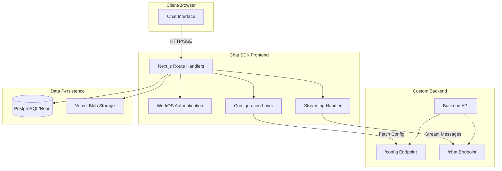

# Architecture Overview

## System Design

Chat SDK is a Next.js application that connects to a custom backend for AI chat functionality. The architecture separates the frontend UI from the AI processing backend, allowing flexible deployment and scaling.

## Core Components

### Frontend Architecture

The Chat SDK organizes its functionality into several key areas:

**Chat Interface** (`components/chat.tsx`)

- Manages the complete chat experience including message history, user input, and streaming responses
- Handles real-time message streaming from the backend
- Persists conversations to PostgreSQL for history retrieval

**Configuration System** (`lib/config/`)

- Three configuration classes control the entire application behavior:
    - `EndpointConfig`: Backend connection details and authentication
    - `ChatConfig`: UI appearance, branding, and initial messages
    - `AdminChatConfig`: Feature toggles like file upload, feedback, and web search
- Configuration can be provided via URL parameters or fetched from backend `/config` endpoint

**Message & Artifact System** (`components/artifact.tsx`, `lib/types/annotations.ts`)

- Supports rich content beyond text through the artifact system
- Artifacts enable code editing, document creation, and other interactive content
- Message annotations add metadata and custom UI components to messages

**Authentication Flow** (`app/(auth)/`)

- WorkOS integration provides enterprise authentication
- Session management through secure cookies
- User data persisted in PostgreSQL

Reference: See component organization in `components/` and `app/` directories.

### Backend Integration

The system connects to a custom backend through a configurable endpoint system:

- **Endpoint Configuration**: Dynamic backend URL configuration
- **Subscription Keys**: Optional API key authentication
- **Config API**: Backend-provided UI configuration

Reference: See `lib/config/` for configuration classes and `lib/utils/endpointUtils.ts` for endpoint determination logic.

### Authentication

WorkOS provides enterprise-grade authentication with:

- Hosted authentication pages
- SSO support
- Session management via cookies

Reference: See `app/(auth)/` for authentication implementation and `docs/workos-authentication.md` for patterns.

## Data Flow

### Chat Message Flow

1. User enters message in the chat interface
2. Frontend sends request to custom backend endpoint
3. Backend processes the message and streams response
4. Frontend displays streaming response progressively
5. Messages are persisted to PostgreSQL

### Configuration Flow

1. URL parameters or backend `/config` endpoint provide configuration
2. `ChatConfig` and `AdminChatConfig` control UI behavior
3. `EndpointConfig` manages backend connection details

Reference: See `lib/utils/configUtils.ts` for configuration retrieval logic.

## Key Design Decisions

### Custom Backend Integration

This implementation uses a custom backend instead of direct AI provider connections. This provides:

- Centralized AI processing
- Custom business logic
- API key management on backend
- Dynamic UI configuration

### Configuration-Driven UI

The UI adapts based on configuration from:

- URL parameters (encrypted where sensitive)
- Backend `/config` endpoint
- Environment-based defaults

This allows the same frontend to serve multiple use cases.

### Streaming Architecture

Real-time streaming is implemented through:

- Server-Sent Events for AI responses
- Resumable streams with Redis (optional)
- Progressive UI updates

Reference: See `components/chat.tsx` for streaming implementation.

## Environment-Specific Behavior

### Development

- Attempts connection to `http://127.0.0.1:8000` first
- Falls back to sample app at `api.intellegam.com`
- Hot reload and debugging enabled

### Production

- Uses endpoint from URL parameters
- Full authentication required
- Optimized builds and caching

Reference: See `lib/utils/environmentUtils.ts` for environment detection.
