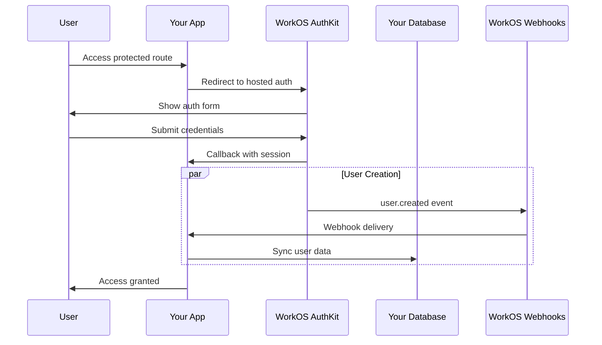
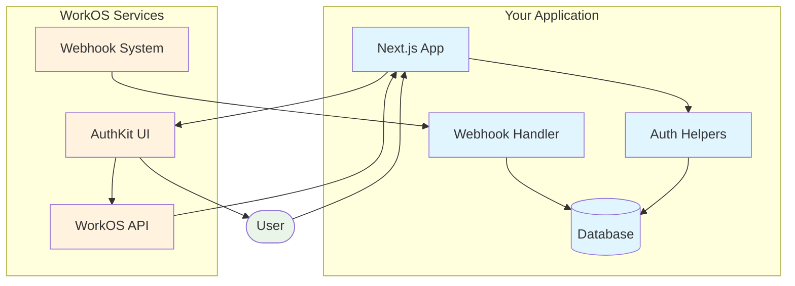
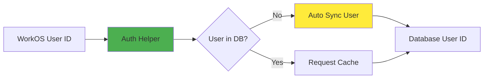
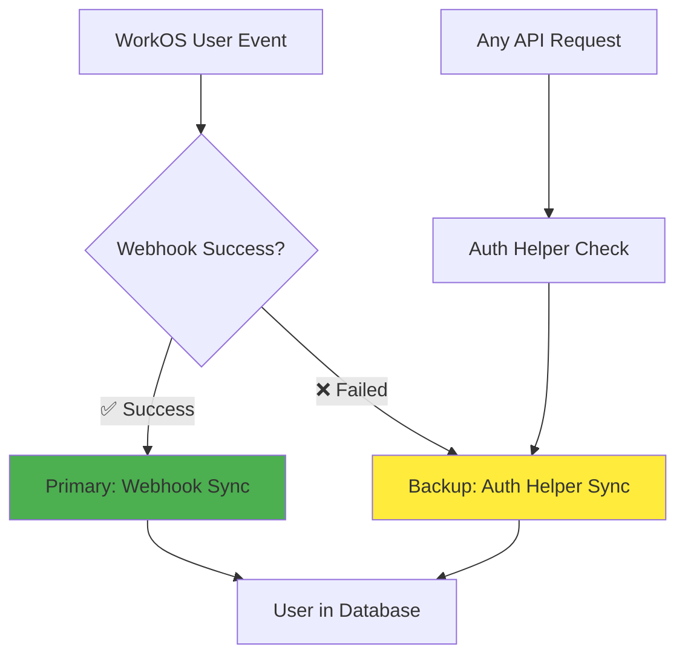

# WorkOS Authentication

## Overview

The application uses WorkOS AuthKit for enterprise-grade authentication with hosted auth pages, SSO support, and automatic user synchronization via webhooks.

### Authentication Flow



### System Architecture



## Key Components

### Authentication Flow
- **Hosted Pages**: WorkOS handles login/register UI
- **Session Management**: Secure cookies via WorkOS AuthKit
- **User Sync**: Webhooks ensure database consistency

### Database Integration
- **Dual Identity**: WorkOS ID + internal database ID
- **Auth Helpers**: Safe mapping between identity systems
- **Webhook Handlers**: Automatic user lifecycle management

Reference: Core implementation in `app/(auth)/` directory

## User Identity Mapping

### The Challenge

WorkOS provides external user IDs, but the application needs internal database IDs for data relationships. Direct usage of WorkOS IDs in database operations creates coupling and sync issues.

### The Solution: Auth Helpers with Automatic Sync

Auth helpers provide safe, cached mapping AND automatic user synchronization:



**🔑 Critical Feature**: Auth helpers **automatically sync users** if they're missing from the database. This means:
- ✅ **Webhooks can fail** - auth helpers provide backup sync
- ✅ **Race conditions handled** - first API call syncs the user
- ✅ **Zero manual intervention** - system self-heals
- ✅ **Request-level caching** - multiple calls in same request are fast

**Key Functions** (see `lib/auth/user-helpers.ts`):
- `getDbUser()` - Full database user record + auto-sync
- `getDbUserId()` - Database ID only + auto-sync
- `isUserSynced()` - Check sync status

**Universal Usage Pattern** - Use this in EVERY API route:
```typescript
const session = await withAuth();
const dbUserId = await getDbUserId(session.user); // ← Auto-syncs if needed
// dbUserId is guaranteed to exist (or null on error)
```

**Why This Matters**: Every database operation uses `dbUserId`, so every API call ensures the user exists. The system becomes resilient to webhook failures, network issues, and race conditions.

Reference: See implementation in ALL API routes under `app/(chat)/api/`

## Webhook Integration

### Purpose & Resilience Strategy

Webhooks provide **primary** user synchronization, while auth helpers provide **backup** synchronization. This dual approach ensures system resilience:



**Resilience Benefits**:
- 🛡️ **Webhook failures don't break the system**
- 🔄 **Self-healing** - first API call fixes missing users
- ⚡ **Zero downtime** - users can authenticate even during webhook outages
- 🎯 **Eventual consistency** - all users end up in the database

### Event Handling

**Supported Events**:
- `user.created` - Sync new users to database
- `user.deleted` - Remove users from database

**Processing Logic**:
- Validates current WorkOS state before database operations
- Handles out-of-order and duplicate events gracefully
- Maintains idempotency across retries

Reference: Implementation in `lib/workos/webhook-handlers.ts`

### Configuration

1. **Environment Variables**:
   ```env
   WORKOS_CLIENT_ID=your_client_id
   WORKOS_API_KEY=your_api_key
   WORKOS_COOKIE_PASSWORD=32_char_secret
   WORKOS_WEBHOOK_SECRET=webhook_secret
   ```

2. **Webhook Endpoint**: Configure in WorkOS dashboard
   ```
   POST https://your-app.com/api/webhooks/workos
   ```

3. **Route Protection**: See middleware configuration in `middleware.ts`

## Migration from Legacy Auth

### Overview

The migration moves from NextAuth credentials to WorkOS hosted authentication while preserving existing user data and session behavior.

### Key Changes

**Authentication Method**:
- Before: Custom login forms with NextAuth
- After: WorkOS hosted authentication pages

**API Route Updates**:
- Replace `auth()` with `withAuth()`
- Use auth helpers instead of direct session.user.id
- Add proper database user ID lookup

**Route Protection**:
- Unauthenticated users redirect to `/start`
- Login/register routes redirect to WorkOS

Reference: See updated routes in `app/(chat)/api/` for implementation patterns

### Migration Pattern

For each API route requiring authentication:

1. **Import Helper**: `import { getDbUserId } from '@/lib/auth/user-helpers'`
2. **Update Auth Check**: Use `withAuth()` instead of legacy auth functions
3. **Add ID Lookup**: Replace direct WorkOS ID usage with database ID
4. **Error Handling**: Handle user sync failures gracefully

Example transformation available in updated route files.

## Development Patterns

### API Route Template

```typescript
import { withAuth } from '@workos-inc/authkit-nextjs';
import { getDbUserId } from '@/lib/auth/user-helpers';

export async function POST(request: Request) {
  // 1. Authenticate
  const session = await withAuth();
  if (!session?.user) {
    return new Response('Unauthorized', { status: 401 });
  }

  // 2. Get database user ID
  const dbUserId = await getDbUserId(session.user);
  if (!dbUserId) {
    return new Response('User not found', { status: 404 });
  }

  // 3. Use database ID for operations
  await yourDatabaseOperation({ userId: dbUserId });
}
```

### Error Scenarios

### Error Scenarios & Auto-Recovery

**User Not Synced**: Auth helpers **automatically sync** via `ensureUserExists` on first API call

**Webhook Failures**: System continues working - auth helpers provide backup sync

**Database Errors**: Auth helpers return null, enabling graceful degradation

**WorkOS Outages**: Existing sessions continue; new logins fail gracefully but sync on recovery

**Race Conditions**: Auth helpers handle concurrent requests safely with database constraints

> 💡 **Key Insight**: Since auth helpers are used in EVERY API route, the system automatically recovers from any sync failure. Users never experience broken functionality due to webhook issues.

Reference: Error handling patterns in `lib/workos/webhook-handlers.ts` and `lib/auth/user-helpers.ts`

## Testing

### Integration Tests

Test webhook processing and user synchronization:
- Duplicate event handling
- Out-of-order event processing
- Concurrent request handling
- Error recovery scenarios

Reference: Test implementations in `tests/integration/workos-*`

### Development Testing

1. **Local Setup**: Configure WorkOS development environment
2. **Webhook Testing**: Use ngrok or similar for local webhook endpoints
3. **User Flows**: Test complete registration and login cycles

## Security Considerations

### Data Protection
- WorkOS IDs never stored in foreign key relationships
- Database user IDs remain internal and stable
- Session data encrypted via WorkOS cookie management

### Access Control
- All protected routes require valid WorkOS session
- Database operations use internal user IDs only
- Webhook signatures validated before processing

### Audit Trail
- User creation/deletion events logged
- Sync failures tracked and alerted
- Authentication attempts monitored via WorkOS

Reference: Security implementation in webhook validation and route protection
