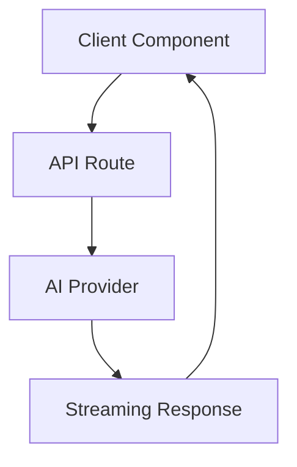

# Chat SDK Documentation Guidelines

## Core Principles

### 1. Separation of Concerns

- **Loose Coupling**: Documentation should be resilient to code changes.
- Focus on concepts, patterns, and _intent_, using code examples sparingly for illustration.
- Reference code files/locations rather than copying implementation details.
- Document the "why" behind architectural decisions, especially for AI integration patterns.

### 2. Focus on Current State & Intent

- Document the system _as it currently exists_. Avoid detailing future plans or historical context unless essential.
- Explain the _purpose_ and _design intent_ behind components, especially:
  - Why certain AI providers are chosen
  - The reasoning behind the artifact system architecture
  - The purpose of message annotations beyond basic chat

### 3. Complement, Don't Duplicate, Code

- Treat documentation as an augmentation of the codebase.
- **Skip documenting**:
  - Simple React components with clear prop types
  - Utility functions with good JSDoc comments
  - TypeScript interfaces that are self-documenting
  - API routes with clear parameter validation
- **Focus on documenting**:
  - Complex state management flows
  - AI SDK integration patterns
  - Server/Client component boundaries
  - Non-obvious architectural decisions

### 4. Documentation Structure

- **Layer 1: Overview & Architecture**
  - High-level system diagrams showing Next.js app structure
  - Core concepts: artifacts, annotations, AI providers
  - Quick start guides for common tasks

- **Layer 2: Component Documentation**
  - Focus on complex components (artifacts, chat interface, AI integrations)
  - Document React Server Component vs Client Component decisions
  - Integration patterns with AI SDK
  - **Always include working examples** for key features

- **Layer 3: Cross-Component Workflows**
  - End-to-end chat flows
  - Artifact creation and streaming
  - Authentication and session management

### 5. Dual Focus Documentation

- **Usage Documentation** (For Developers Using Chat SDK)
  - How to add new AI providers
  - Creating custom artifacts
  - Extending message annotations
  - **Practical examples** demonstrating real patterns

- **Technical Documentation** (For Contributors)
  - Streaming architecture decisions
  - Database schema rationale
  - Performance considerations for real-time features
  - **Architectural diagrams** showing data flow

## Documentation Types

### 1. Overview Documentation (`overview.md`)

- Introduces the Chat SDK system
- Covers high-level architecture, key concepts
- **Includes quickstart examples** for basic chat implementation
- Shows how components interact in the Next.js app structure

### 2. Feature Documentation

Each major feature should have:

```
docs/features/
├── artifacts/
│   ├── overview.md          # Artifact system architecture
│   ├── creating-artifacts.md # Step-by-step guide
│   └── streaming.md         # Streaming implementation
├── ai-providers/
│   ├── overview.md          # Provider system design
│   ├── adding-providers.md  # Integration guide
│   └── provider-config.md   # Configuration patterns
└── annotations/
    ├── overview.md          # Annotation system
    └── custom-annotations.md # Extending annotations
```

### 3. Development Workflows

- **Cross-Feature Operations**
  - Full chat implementation with artifacts
  - Setting up authentication with WorkOS
  - Deploying with proper environment configuration

- **Task-Oriented Guides**
  - "How to add a new AI model"
  - "How to create a custom artifact type"
  - "How to implement custom authentication"

## React/Next.js Specific Guidelines

### Component Documentation

```markdown
# ComponentName

## Purpose
What this component does and why it exists.

## Component Type
- [ ] Server Component
- [ ] Client Component
- Rationale for the choice

## Props & State
Key props and state management approach (only if complex).

## Usage Example
\```tsx
<ComponentName
  prop1="value"
  onAction={handleAction}
/>
\```

## Integration Notes
How it fits into the larger system.
```

### Route Documentation

Document API routes and pages with:
- Purpose and authentication requirements
- Request/Response schemas (reference TypeScript types)
- Rate limiting or special considerations
- Example usage with actual fetch/axios calls

## Style Guidelines

### 1. Code Examples

- **TypeScript by default** - All examples should use TypeScript
- **Complete imports** - Show all necessary imports
- **Realistic examples** - Use actual use cases from the app
- **Async/Server patterns** - Clearly mark Server vs Client code

```tsx
// ✅ Good: Clear component type and complete example
'use client'; // or indicate Server Component

import { useState } from 'react';
import { useChat } from '@/hooks/use-chat';

export function ChatInterface() {
  const { messages, sendMessage } = useChat();
  // ...
}
```

### 2. Diagrams

Use **Mermaid** for:
- Component hierarchies
- Data flow through the app
- Authentication flows
- AI provider interactions
- Streaming architecture



### 3. File Organization

```
docs/
├── README.md                    # Navigation hub
├── getting-started/             # Onboarding
│   ├── quick-start.md
│   ├── prerequisites.md
│   └── first-chat.md
├── architecture/                # System design
│   ├── overview.md
│   ├── streaming.md
│   └── security.md
├── features/                    # Feature guides
│   ├── artifacts/
│   ├── ai-providers/
│   └── annotations/
├── development/                 # Dev process
│   ├── documentation-guidelines.md
│   ├── code-standards.md
│   ├── testing-guidelines.md
│   └── fork-maintenance.md     # Fork sync practices
├── api/                        # API reference
│   ├── routes/
│   └── hooks/
└── deployment/                 # Production guides
    ├── vercel.md
    └── self-hosting.md
```

## When NOT to Document

- **Simple React components** with TypeScript props that are self-explanatory
- **Utility functions** covered by JSDoc comments
- **Standard Next.js patterns** (unless customized)
- **TypeScript interfaces** that are well-named and clear
- **Straightforward API routes** with good typing

## Documentation Review Checklist

- [ ] Does it explain the "why" not just the "what"?
- [ ] Are examples practical and runnable?
- [ ] Is it findable in the logical location?
- [ ] Does it complement rather than duplicate code?
- [ ] Will it survive minor refactoring?
- [ ] Is it appropriate for the target audience?

## Fork-Specific Documentation

### Tracking Divergence

Maintain a `FORK_CHANGES.md` file at the root:

```markdown
# Fork Changes Log

## Overview
This document tracks all significant divergences from upstream.

## Modified Files
| File | Reason | Lines | Can Upstream? |
|------|--------|-------|---------------|
| components/chat.tsx | Excel import support | 145-167 | No - specific use case |
| lib/ai/streaming.ts | Performance optimization | 78-92 | Yes - PR #123 pending |

## Custom Features
1. **Excel Import** - Business requirement for data analysis
2. **Custom Auth** - Enterprise SSO integration
3. **Advanced Artifacts** - Spreadsheet and presentation types

## Upstream Contributions
- [x] Streaming performance fix (merged PR #123)
- [ ] Error boundary improvements (planned)
```

### Document Custom Features Clearly

When documenting fork-specific features:

```markdown
# Excel Import Feature

> **Fork-Specific Feature**: This functionality is unique to our fork and not available in the upstream project.

## Overview
[Feature description]

## Upstream Impact
- Modified files: `components/chat-input.tsx` (lines 45-67)
- New files: `lib/excel/*`, `components/excel-import/*`
- Can be disabled via: `ENABLE_EXCEL_IMPORT=false`
```
