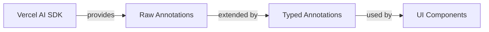

# Message Annotations

## Overview

Message annotations extend the Vercel AI SDK's basic annotation capabilities by providing a structured, type-safe system for attaching metadata to messages. While the SDK allows for arbitrary annotations, the TypedAnnotations system enforces consistency and enables rich UI experiences beyond what basic message content can provide.

## TypedAnnotations and Message Annotations

### The Connection

Messages in the Vercel AI SDK can contain arbitrary annotations as metadata. The TypedAnnotations system builds upon this by:

1. Defining specific annotation structures with TypeScript interfaces
2. Providing type guards and utility functions for working with annotations safely
3. Establishing patterns for connecting annotations to UI components



### Why TypedAnnotations?

TypedAnnotations solve several problems:

1. **Type Safety**: Ensures annotations have consistent structure through TypeScript interfaces
2. **Validation**: Provides runtime checks to verify annotation structure
3. **Discoverability**: Makes available annotation types explicit in the codebase
4. **Component Mapping**: Creates a clear connection between annotations and UI components

## Enhancing UI with Annotations

### Beyond Basic Text

Standard message content is limited to text, while annotations enable:

1. **Interactive Components**: Tools with rich interfaces like search results
2. **Contextual Rendering**: Different presentations based on data type or source
3. **Multiple Views**: Various ways to display the same content
4. **Metadata Preservation**: Keep context about content without cluttering text

### Example: Search Tool UI

The search tool example demonstrates how annotations enable rich UI experiences:

```typescript
// A single search tool can have multiple annotation types
message.annotations = [
  {
    // 1. ToolView annotation specifies how to render
    annotationType: "toolView",
    toolCallId: "search_123",
    toolViewId: "webSearch",
    toolViewData: { query: "climate solutions" },
  },
  {
    // 2. Sources annotation provides the data
    annotationType: "sources",
    toolCallId: "search_123",
    sources: [
      {
        text: "Recent advances in solar technology...",
        url: "https://example.com/solar",
        headings: ["Renewable Energy", "Solar"],
      },
      // More sources...
    ],
  },
];
```

When rendered, the search component uses both annotations:

- The ToolView annotation determines the component type and its configuration
- The Sources annotation provides the actual search results to display

The rendered UI can adapt based on the specific toolViewId, showing different icons or layouts:

```typescript
// Example adaptation in the SearchToolComponent
const getSearchTypeIcon = (toolViewId) => {
  switch (toolViewId) {
    case "webSearch":
      return <GlobeIcon />;
    case "databaseSearch":
      return <DatabaseIcon />;
    default:
      return <SearchIcon />;
  }
};
```

## TypedAnnotations System Architecture

### Type Hierarchy

The system uses a hierarchical type structure:

1. **Base Interface**: All annotations extend `TypedMessageAnnotation`
2. **Specific Interfaces**: Each annotation type has its own interface
3. **Type Mapping**: A mapping connects annotation types to their interfaces

```typescript
// Base interface
interface TypedMessageAnnotation {
  annotationType: MessageAnnotationType;
}

// Specific interface
interface ToolViewAnnotation extends TypedMessageAnnotation {
  annotationType: MessageAnnotationType.ToolView;
  toolCallId: string;
  toolViewId: ToolViewId;
  toolViewData: Record<string, unknown>;
}

// Type mapping
type MessageAnnotationTypeMap = {
  [MessageAnnotationType.ToolView]: ToolViewAnnotation;
  [MessageAnnotationType.Sources]: SourcesAnnotation;
};
```

### Type Guards and Utilities

The system includes essential utility functions that make working with annotations safer and more convenient:

#### Type Validation with isTypedMessageAnnotation

**Function signature**: `isTypedMessageAnnotation(value: unknown): value is TypedMessageAnnotation`

This function acts as a type guard to verify if an unknown value is actually a TypedMessageAnnotation. It performs several checks:

1. Confirms the value is not null
2. Verifies it's an object (not a primitive or array)
3. Checks if it has an 'annotationType' property
4. Ensures the annotationType is a string

This is critical because annotations come from external sources (like API responses) and need validation before they can be safely processed.

#### Finding Annotations by Type

**Function signature**: `getMessageAnnotationsByType<T extends MessageAnnotationType>(annotations: unknown[] | undefined, type: T): MessageAnnotationTypeMap[T][]`

This utility simplifies the common task of filtering annotations by their type. It:

1. Takes an array of potentially unknown annotations
2. Safely filters for annotations of a specific type
3. Returns a properly typed array of those annotations

This provides type safety while avoiding repetitive filter code throughout the application.

#### Finding Annotations by Type and Tool ID

**Function signature**: `getMessageAnnotationsByTypeAndToolId<T extends AnnotationTypesWithToolCallId>(annotations: unknown[] | undefined, type: T, toolCallId: string): Extract<MessageAnnotationTypeMap[T], { toolCallId: string }>[]`

This specialized utility connects annotations to specific tool calls by:

1. Finding annotations of a specific type
2. Filtering for those that reference a particular tool call ID
3. Returning only annotations that match both criteria

**Important**: This function can only be used with annotation types that include a `toolCallId` property. The generic constraint `T extends AnnotationTypesWithToolCallId` ensures this at compile time.

### Tool Call Connection

The `toolCallId` property is a crucial bridging mechanism in the annotation system:

1. **Tool Invocation Parts** contain a unique `toolCallId` that identifies a specific tool call
2. **Annotations** can reference this same ID to provide metadata about that specific tool call
3. **UI Components** use this connection to find relevant annotations for a tool call

This creates a powerful pattern where multiple annotations can enhance a single tool call:

```
Message
├── Parts
│   └── ToolInvocation (toolCallId: "abc123")
└── Annotations
    ├── ToolView (toolCallId: "abc123")
    ├── Sources (toolCallId: "abc123")
    └── Analytics (toolCallId: "abc123")
```

When rendering a tool invocation, components can use `getMessageAnnotationsByTypeAndToolId` to find all relevant annotations for that specific tool call, enabling rich UI experiences driven by multiple annotation types.

## Creating New Annotation Types

Adding a new annotation type involves several steps:

### 1. Update the Enum

Add your new type to the `MessageAnnotationType` enum:

```typescript
export enum MessageAnnotationType {
  ToolView = "toolView",
  Sources = "sources",
  CustomAnnotation = "customAnnotation", // Your new type
}
```

### 2. Define the Interface

Create an interface for your annotation that extends the base interface:

```typescript
export interface CustomAnnotation extends TypedMessageAnnotation {
  annotationType: MessageAnnotationType.CustomAnnotation;

  // Add properties specific to your annotation
  customId: string;
  metadata: {
    title: string;
    description?: string;
    options: string[];
  };
}
```

### 3. Update the Type Mapping

Add your annotation to the mapping so it's recognized by the utility functions:

```typescript
export type MessageAnnotationTypeMap = {
  [MessageAnnotationType.ToolView]: ToolViewAnnotation;
  [MessageAnnotationType.Sources]: SourcesAnnotation;
  [MessageAnnotationType.CustomAnnotation]: CustomAnnotation;
};
```

### Tool-Specific vs. Generic Annotations

You can combine tool-specific annotations with general-purpose ones:

- Tool-specific: Provide data for particular tool types
- Generic: Apply to various message or tool types

For example, a "theme" annotation could apply to any component, while a "data-visualization" annotation would be specific to chart tools.

## Best Practices

### Design for Evolution

- Include version fields in complex annotations
- Use optional properties for non-critical features
- Consider backward compatibility when updating annotation structures

### Balance Specificity and Flexibility

- Be specific enough to ensure type safety
- Be flexible enough to accommodate various use cases
- Use discriminated unions for annotations with multiple variants

### Runtime Safety

- Always use the utility functions to access annotations
- Include runtime validation for critical annotation data
- Handle missing or malformed annotations gracefully

### Component Architecture

- Design components to handle annotation changes cleanly
- Avoid tightly coupling components to specific annotation versions
- Consider using annotation adapters for complex transformations
